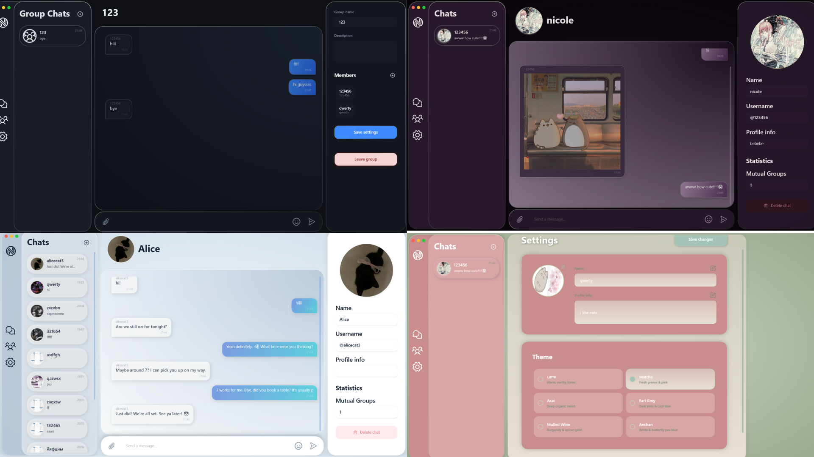

<div align="center">



<br><br>

# ⋆ ˚｡⋆ [ n o d o ] ⋆｡˚ ⋆

*minimalist desktop messaging client* `clean ui` ⋆ `custom themes` ⋆ `wpf architecture`

<br>

### 🪷 ａｂｏｕｔ ｐｒｏｊｅｃｔ
nodo is a beautifully crafted desktop messaging application. 
built with a strong focus on aesthetics and user experience, 
it offers a distraction-free environment for communication.

<br>

### 🎧 ｍｙ ｒｏｌｅ
**ui / ux designer & front-end implementer**
⋆ designed the complete user interface from scratch in figma.
⋆ implemented complex layouts, custom controls, and animations using wpf (xaml).
⋆ developed a custom color-theming system based on tea aesthetics.

<br>

### 💿 ｔｅｃｈ ｓｔａｃｋ


<br>


<br><br>
</div>

---


## ⚙️ Getting Started

### Prerequisites
* **OS:** Windows 10/11 (for the Client).
* **.NET SDK:** .NET 8.0 SDK (for building the project).
* **.NET Runtime:** .NET 8.0 Desktop Runtime (for running the Client).
* **Database:** PostgreSQL.

### 🐘 Database Setup (PostgreSQL)

The server handles database creation automatically. You don't need to write SQL scripts manually.

1.  **Install PostgreSQL**
    Download and install the latest version for Windows from the [official website](https://www.postgresql.org/download/windows/).
    > **⚠️ Important:** During installation, remember the password you set for the `postgres` superuser.

    You can leave the other settings (port 5432, locale) as default.

2.  **Run the Server**
    When you launch `uchat_server` (see below), it will prompt you for the database password:
    ```text
    Enter PostgreSQL password for 'postgres':
    ```

3.  **Enter Password**
    Type the password you set during installation and press `Enter`. The server will automatically connect, apply migrations, and create the `uchat` database with all necessary tables.

## 🔨 Building the Project

To build the project, open a terminal (PowerShell) in the project root and run:

```powershell
dotnet build uchat.sln -c Release -m
```

After a successful build:
- All build artifacts will be in the `bin/Release/` folder
- Executable files and dependencies will be automatically copied to the project root for easy execution
- You can now run the server and client from the root folder (see below)

## 🏃‍♂️ How to Run

### 1. Start the Server
Open a terminal (PowerShell) in the project root and run:

```powershell
./uchat_server 8080
```
(Where `8080` is the port number).

### 2. Start the Client
Open a new terminal window in the project root and run:

```powershell
./uchat 127.0.0.1 8080
```
(Specifying the Server IP and Port).

> **Note:** Make sure the server is running before starting the client.

